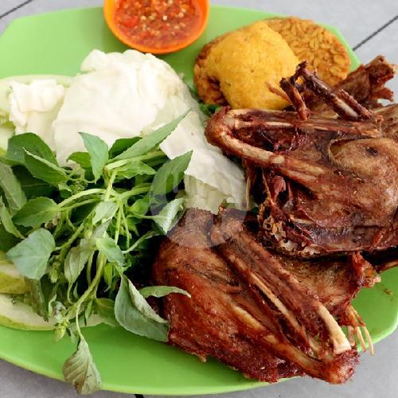
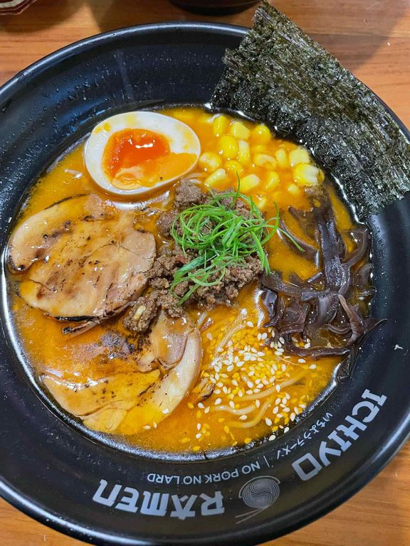
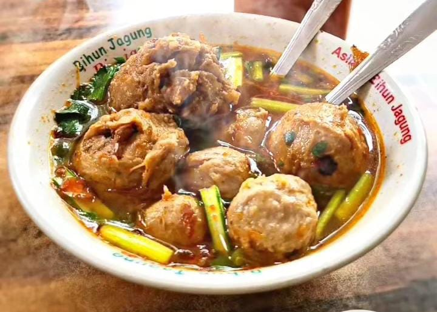
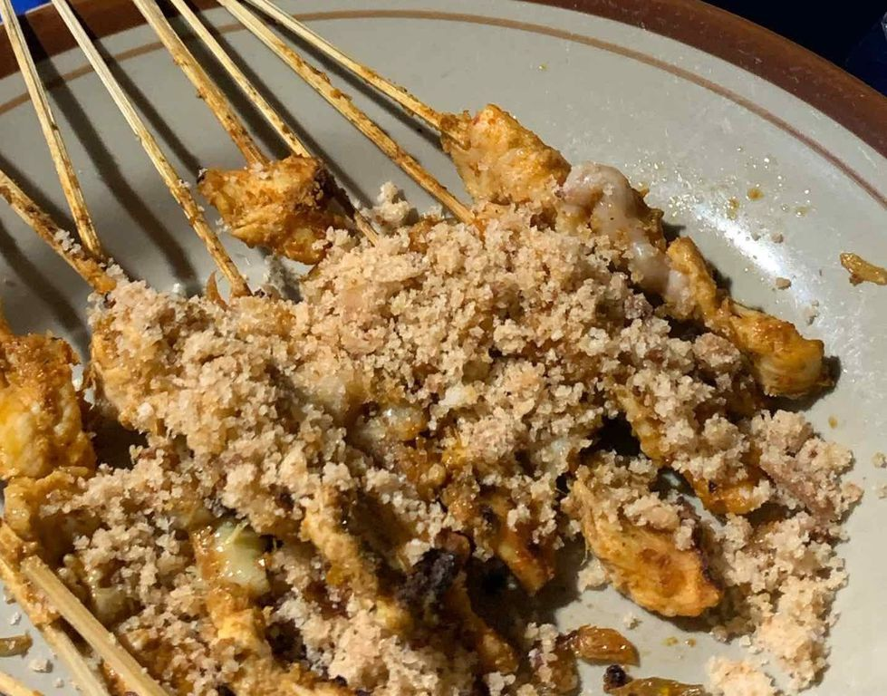

<!DOCTYPE html>
<html lang="en">
<head>
  <meta charset="UTF-8">
  <meta name="viewport" content="width=device-width, initial-scale=1.0">
  <title>Mau Makan Apa</title>
  
</head>
<body>
  <header>
    <h1>Mau mam apa sayanggg</h1>
    
pilih makanan yang kamu mauu

  </header>
  
  

    

      
      <h3>Pecel Lele</h3>
    

    

      
      <h3>Ramen</h3>
    

    

      
      <h3>Baso</h3>
    

    

      
      <h3>Ayam Om Hans</h3>
    

    

      
      <h3>Mie Djawa</h3>
    

  

  

  

    <h2>Food yang kamu pilih:</h2>
    
  

  <footer>
    
© 2025 Rafi Eka Cahya Muhammad

  </footer>

  
</body>
</html>
